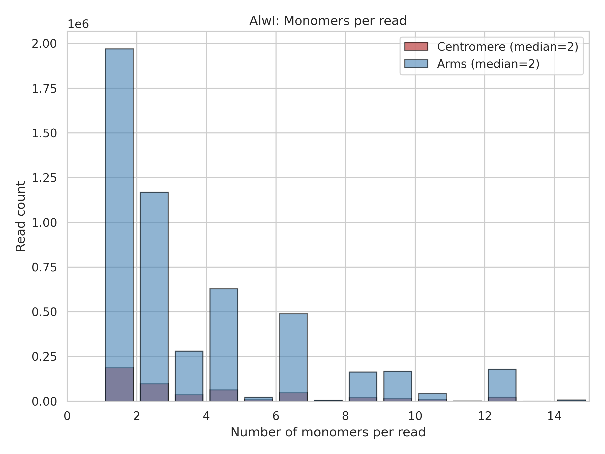
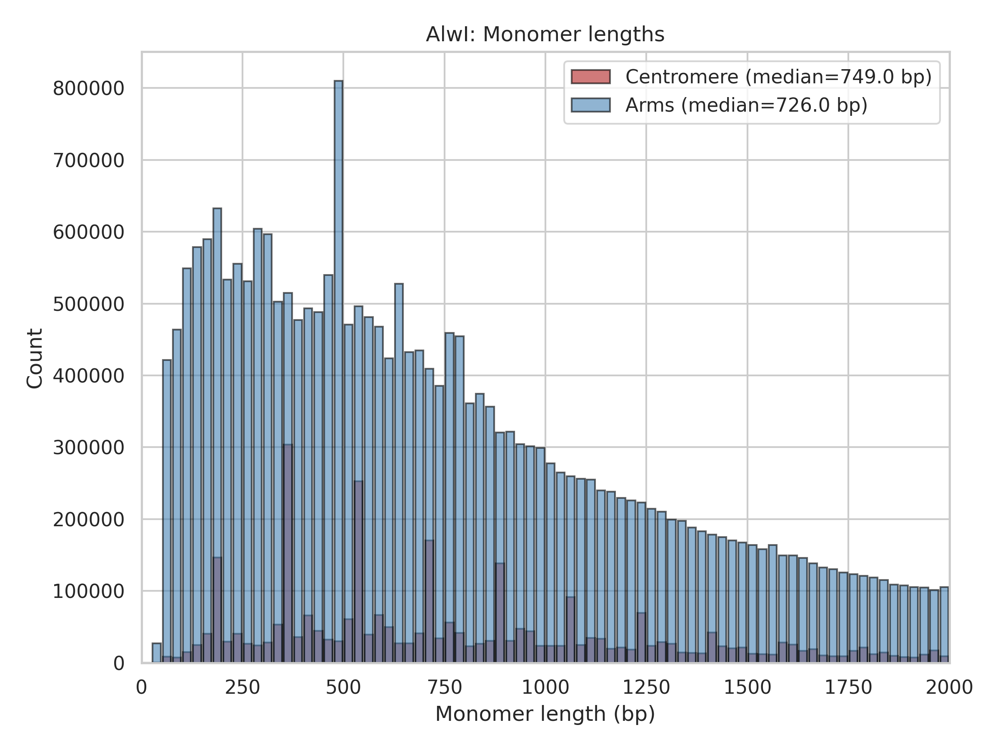

# Example Monomer Analysis Plots

These are example outputs from the monomer statistics plotting script (`scripts/plotting/plot_monomer_stats.py`).

## Plots

### Monomers per Read Distribution



This histogram shows the distribution of the number of restriction enzyme cut sites (monomers) detected per read.

**Key observations:**
- **Centromeric regions** (red/firebrick): Median ~4-6 monomers per read
- **Chromosome arms** (blue/steelblue): Median ~3-5 monomers per read
- Long nanopore reads can capture multiple chromatin contacts in a single molecule

### Monomer Length Distribution



This histogram shows the distribution of distances between consecutive cut sites (monomer lengths).

**Key observations:**
- **Centromeric regions** (red/firebrick): Median ~180-200 bp
- **Chromosome arms** (blue/steelblue): Median ~170-190 bp
- Both regions show similar fragment size distributions
- Distribution peaks around the expected fragment size for the restriction enzyme used

## Dataset Information

- **Organism:** *Arabidopsis thaliana* (Col-0)
- **Restriction enzyme:** AlwI (GGATC^)
- **Sequencing:** Oxford Nanopore long-read sequencing
- **Data:** Real experimental Pore-C data (July 2025)

## Interpreting These Plots

### Monomers per Read
- Higher numbers indicate more complex multi-way contacts captured
- Differences between centromeres and arms can indicate structural differences
- X-axis typically limited to 0-15 for clarity (rare reads may have more)

### Monomer Length
- Shows the cutting efficiency and uniformity of the restriction enzyme
- Balanced cutting should show similar distributions in centromeres vs arms
- Peak position depends on enzyme (4-cutter vs 6-cutter)

## Generating Your Own Plots

```bash
# 1. Convert BAM to SAM
samtools view -h results/bams/sample.cs.bam > sample.cs.sam

# 2. Generate plots
python scripts/plotting/plot_monomer_stats.py sample.cs.sam my_sample_name
```

This will generate:
- `monomers_per_read_hist.png`
- `monomer_length_hist.png`

## Centromere Coordinates Used

The plotting script uses these Arabidopsis thaliana centromere coordinates:
- Chr1: 14,841,147 - 17,216,861
- Chr2: 4,621,558 - 6,841,935
- Chr3: 13,596,351 - 15,826,119
- Chr4: 5,208,113 - 7,982,091
- Chr5: 12,402,000 - 15,178,500

For other organisms, modify the `centromeres` dictionary in the script.
